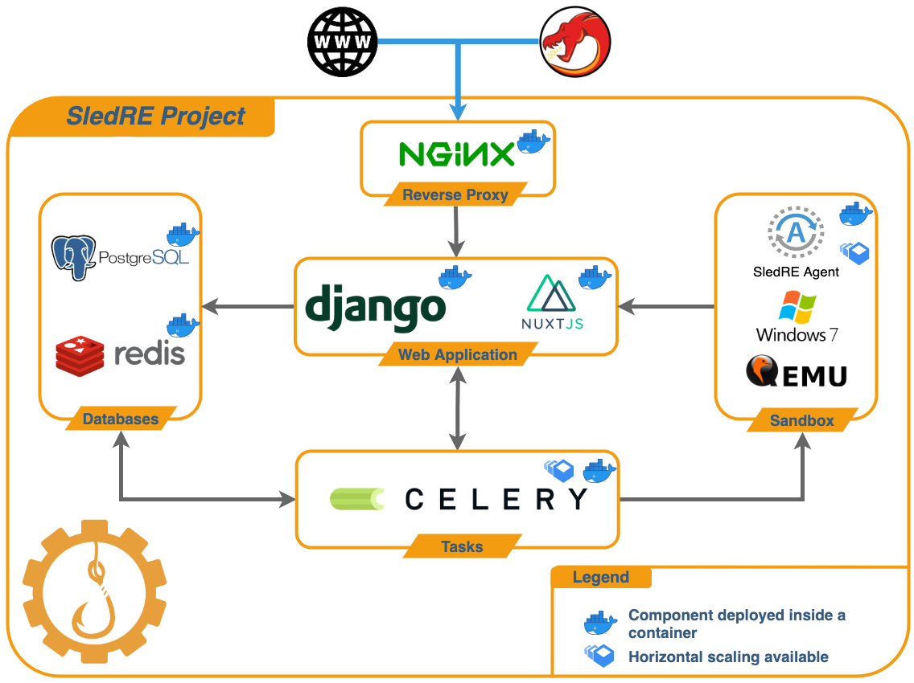

<p align="center">
  
</p>

[](https://github.com/sledre/sledre/actions/workflows/release.yml)
[](https://github.com/sledre/sledre/actions/workflows/linter.yml)
# SledRE


## Introduction

SledRE is a scalable application for Windows malware analysis.
For the moment only PESieve and Detours are integrated.

[PESieve](https://github.com/hasherezade/pe-sieve) job goal is to unpack a Windows PE malware.  
[Detours](https://github.com/microsoft/Detours) job goal is to hook syscalls called by a Windows PE malware. 

On the one hand, this application could be used as an analysis pipeline for Windows malware.  
On the other hand, it could be used to generate a large dataset which can contains results from differents tools.
This dataset could then be used in machine learning to try to classify samples by families.

Detours traces can directly be imported in Ghidra using [ghidra-sledre](https://github.com/sledre/ghidra-sledre/) extension.

## Architecture
<p align="center">
  
</p>

## Installation

### Prerequisites

- [X] Docker installed and running
- [X] docker-compose
- [X] Python3 and pip3 for the setup script
- [X] qemu-convert binary (found in package qemu-utils)

### Procedure
To install the project, download and unzip the latest release.  
Then, run the following commands:
```bash
sudo apt update && sudo apt install qemu-utils
pip3 install -r requirements.txt
python3 setup.py -w <nbr_workers>
```
If you wish to allow the Windows VMs internet access (and also LAN access if you don't setup any firewall rules), you can use the `--disable-network-isolation` option.

## Usage
To run the project, just use the following command:

```bash
docker-compose -p sledre up -d
```

You can now launch the app on your favorite Browser and upload your samples. Once the treatment is done you can download the results list (in a JSON format) on your computer.
The application should be available at http://172.20.0.10/


## Contributing
To contribute, you should install the project in development mode.
The complete instructions are available on [SledRE Documentation](https://sled.re/project-setup/installation/).  
Here is a quick summary. Start by cloning the repository in recursive mode:
```bash
git clone --recursive git@github.com:sledre/sledre.git
```

Then install the dependencies:
```bash
sudo apt update && sudo apt install -y qemu-utils
pip3 install -r requirements.txt
```

Now, you'll need the agent binaries. If you're looking for a specific version or directly modifying and testing the agent, you should compile everything yourself (static binaries such as `7zip` and `dotnetframework` are located in `sledre/agent/bin`).
If you're not editing the agent <-> API interactions, then everything should work fine with the bin folder of the latest SledRE release.

Then you can setup the project using the `setup.py` script:
```bash
python3 setup.py --dev -w <nbr_workers>
```

Finally, run the following command to start the application:
```bash
docker-compose -f docker-compose.dev.yml up -d
```

In development configuration, backend and frontend folders are shared with containers using volumes so the project support hot reload.  
However, when editing celery tasks, do not forget to restart the celery container.  
You'll also need recreate the Windows VM everytime you're editing the agent.
